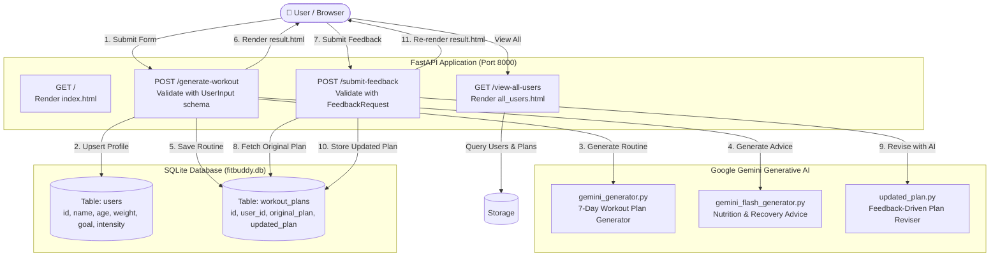

# 💪 FitBuddy - AI Fitness & Workout Plan Generator

> An intelligent, full-stack fitness plan and nutrition tip generator powered by FastAPI, SQLAlchemy, Google Gemini 3.6 models, and Jinja2 templates.

---

## 📑 Table of Contents
1. [Overview & Features](#overview--features)
2. [System Architecture & Data Flow](#system-architecture--data-flow)
3. [Technology Stack](#technology-stack)
4. [Project Directory Structure](#project-directory-structure)
5. [Installation & Setup Guide](#installation--setup-guide)
6. [Database Schema & Models](#database-schema--models)
7. [API Route Specifications](#api-route-specifications)
8. [Gemini AI Engine & Prompt Engineering](#gemini-ai-engine--prompt-engineering)
9. [Frontend Templates & UI](#frontend-templates--ui)
10. [Complete Source Code Walkthrough](#complete-source-code-walkthrough)
    - [`requirements.txt`](#1-requirementstxt)
    - [`.env.example`](#2-envexample)
    - [`app/main.py`](#3-appmainpy)
    - [`app/database.py`](#4-appdatabasepy)
    - [`app/schemas.py`](#5-appschemaspy)
    - [`app/gemini_generator.py`](#6-appgemini_generatorpy)
    - [`app/gemini_flash_generator.py`](#7-appgemini_flash_generatorpy)
    - [`app/updated_plan.py`](#8-appupdated_planpy)
    - [`app/routes.py`](#9-approutespy)
    - [`templates/index.html`](#10-templatesindexhtml)
    - [`templates/result.html`](#11-templatesresulthtml)
    - [`templates/all_users.html`](#12-templatesall_usershtml)
11. [Running the Application](#running-the-application)
12. [Troubleshooting & FAQ](#troubleshooting--faq)

---

## 🌟 Overview & Features

**FitBuddy** is an end-to-end web application that tailors personal 7-day workout routines and nutrition guidance according to a user's age, weight, target fitness goal, and preferred workout intensity. It also supports iterative plan updates based on user feedback.

### Key Highlights
- **Personalized 7-Day Workout Routine:** Generates daily warm-ups, targeted exercises with sets/reps, and cooldown advice.
- **Goal-Driven Nutrition & Recovery Tips:** Instant nutritional and recovery recommendations tailored to specific fitness goals (e.g., muscle gain, weight loss).
- **Interactive Feedback Revision Loop:** Users can submit natural language feedback (e.g., *"I injured my knee, remove squats"*) and Gemini rewrites the relevant days while keeping the rest intact.
- **Relational Persistence with SQLite:** Stores user profiles and workout plans (both original and updated versions).
- **Admin Dashboard:** `/view-all-users` route to review all registered users, fitness goals, and generated workout regimens.
- **Resilient AI Pipeline:** Exponential backoff retry logic and fallback model switching across `gemini-3.6-flash` and `gemini-3.6-flash-lite`.

---

## 🏗️ System Architecture & Data Flow



---

## 🛠️ Technology Stack

| Layer | Component | Description |
|---|---|---|
| **Backend Framework** | [FastAPI](https://fastapi.tiangolo.com/) `v0.110.0` | High-performance Python web framework with async support |
| **ASGI Server** | [Uvicorn](https://www.uvicorn.org/) `v0.29.0` | Fast ASGI web server implementation |
| **Generative AI** | [Google GenAI SDK](https://github.com/googleapis/python-genai) `google-genai>=1.0.0` | Official client for Gemini models (`gemini-3.6-flash`, `gemini-3.6-flash-lite`) |
| **Database ORM** | [SQLAlchemy](https://www.sqlalchemy.org/) `v2.0.29` | Database abstraction and ORM mapped to SQLite |
| **Database** | [SQLite](https://www.sqlite.org/) | Zero-configuration serverless file database (`fitbuddy.db`) |
| **Templating** | [Jinja2](https://palletsprojects.com/p/jinja/) `v3.1.3` | Server-rendered HTML templates |
| **Data Validation** | [Pydantic](https://docs.pydantic.dev/) | Request parsing and data validation |
| **Config & Env** | [python-dotenv](https://github.com/theskumar/python-dotenv) `v1.0.1` | Loads environment variables from `.env` |

---

## 📂 Project Directory Structure

```plaintext
fitbuddy/
│
├── app/
│   ├── __init__.py                # Package marker
│   ├── main.py                   # FastAPI app initialization, static mount, entrypoint
│   ├── routes.py                 # Endpoint route handlers (GET /, POST /generate-workout, etc.)
│   ├── database.py               # SQLAlchemy models (User, WorkoutPlan) and DB helpers
│   ├── schemas.py                # Pydantic data schemas (UserInput, FeedbackRequest)
│   ├── gemini_generator.py       # 7-day workout plan generation via Google GenAI SDK
│   ├── gemini_flash_generator.py # Nutrition and recovery tips generation
│   └── updated_plan.py           # Plan modification based on user feedback
│
├── static/
│   └── images/
│       └── gym-bg.jpg            # Fitness background image for UI pages
│
├── templates/
│   ├── index.html                # Initial questionnaire form (Name, Age, Weight, Goal, Intensity)
│   ├── result.html               # Results page (Workout plan, Nutrition tip, Feedback submission form)
│   └── all_users.html            # Admin table listing all stored users and plans
│
├── .env                          # Local secret keys (ignored by git)
├── .env.example                  # Template for required environment variables
├── .gitignore                    # Git ignore file (excludes venv, .env, __pycache__, DB)
├── fitbuddy.db                   # SQLite database file
├── README.md                     # Comprehensive project documentation (this file)
└── requirements.txt              # Pinned Python package dependencies
```

---

## ⚙️ Installation & Setup Guide

### 1. Prerequisites
- **Python**: Version 3.10, 3.11, or 3.12 installed.
- **Google Gemini API Key**: Obtain a key from [Google AI Studio](https://aistudio.google.com/).

### 2. Clone and Open Directory
```bash
git clone <repo-url> fitbuddy
cd fitbuddy
```

### 3. Create and Activate Virtual Environment
- **On Windows (PowerShell):**
  ```powershell
  python -m venv venv
  .\venv\Scripts\Activate.ps1
  ```
- **On Linux / macOS:**
  ```bash
  python3 -m venv venv
  source venv/bin/activate
  ```

### 4. Install Dependencies
```bash
pip install -r requirements.txt
```

### 5. Configure Environment Variables
Copy `.env.example` to `.env` and fill in your Gemini API key:
```bash
cp .env.example .env
```
Inside `.env`:
```env
GOOGLE_API_KEY="YOUR_ACTUAL_GEMINI_API_KEY"
```

---

## 🗄️ Database Schema & Models

FitBuddy uses SQLite through SQLAlchemy 2.0 ORM (`app/database.py`). Tables are auto-created when the application starts.

### 1. `users` Table
Stores registered user profile data.

| Column | Type | Constraints | Description |
|---|---|---|---|
| `id` | `INTEGER` | `PRIMARY KEY, INDEX` | Unique User ID supplied by user |
| `name` | `VARCHAR` | `INDEX` | User's full name / nickname |
| `age` | `INTEGER` | `NOT NULL` | Age in years |
| `weight` | `FLOAT` | `NOT NULL` | Weight in kilograms |
| `goal` | `VARCHAR` | `NOT NULL` | Fitness goal (e.g. "Fat Loss", "Hypertrophy") |
| `intensity` | `VARCHAR` | `NOT NULL` | Selected intensity (`Low`, `Medium`, `High`) |

### 2. `workout_plans` Table
Stores generated workout plans and revisions linked by `user_id`.

| Column | Type | Constraints | Description |
|---|---|---|---|
| `id` | `INTEGER` | `PRIMARY KEY, AUTOINCREMENT` | Internal primary key |
| `user_id` | `INTEGER` | `FOREIGN KEY(users.id)` | Foreign key referencing `users.id` |
| `original_plan` | `TEXT` | `NOT NULL` | Full text of initial 7-day AI workout plan |
| `updated_plan` | `TEXT` | `NULLABLE` | Revised workout plan generated after feedback |

---

## 🌐 API Route Specifications

| Route | Method | Content-Type | Parameters / Body | Description |
|---|---|---|---|---|
| `/` | `GET` | `text/html` | None | Renders `index.html` containing the input form |
| `/generate-workout` | `POST` | `application/x-www-form-urlencoded` | `username`, `user_id`, `age`, `weight`, `goal`, `intensity` | Saves user, generates workout & nutrition tip with Gemini, stores plan, renders `result.html` |
| `/submit-feedback` | `POST` | `application/x-www-form-urlencoded` | `user_id`, `feedback` | Retrieves original plan, prompts Gemini to adapt it, saves to `updated_plan`, re-renders `result.html` |
| `/view-all-users` | `GET` | `text/html` | None | Queries all users and their workout plans, renders `all_users.html` dashboard |
| `/docs` | `GET` | `text/html` | None | FastAPI interactive Swagger UI |
| `/redoc` | `GET` | `text/html` | None | FastAPI ReDoc API documentation |

---

## 🤖 Gemini AI Engine & Prompt Engineering

The AI pipeline is powered by the Google GenAI SDK (`google-genai`).

### Resilience & Fallback Architecture
All generator functions (`app/gemini_generator.py`, `app/gemini_flash_generator.py`, `app/updated_plan.py`) implement:
1. **Fallback Model Priority**: Attempts `gemini-3.6-flash` first; on failure, switches to `gemini-3.6-flash-lite`.
2. **Exponential Backoff**: If an HTTP 503 (Server Unavailable / Rate Limited) occurs, retries up to 3 times waiting $2^{\text{attempt} + 1}$ seconds (2s, 4s, 8s).

### 1. Workout Plan Prompt (`app/gemini_generator.py`)
```text
You are a professional fitness trainer.

Create a personalized, structured 7-day workout plan for someone with the goal of **{goal}**, and prefers **{intensity}** intensity workouts.

Each day must include:
- A warm-up (5-10 mins)
- Main workout (targeted exercises, sets & reps)
- Cooldown or recovery tip

Format:
Day 1:
Warm-up: ...
Main Workout: ...
Cooldown: ...
(Repeat for Day 2-7)
```

### 2. Nutrition Tip Prompt (`app/gemini_flash_generator.py`)
```text
Give one clear, helpful nutrition or recovery tip for someone focused on '{goal}'.
The tip should be practical, friendly, and easy to understand.
```

### 3. Feedback Plan Update Prompt (`app/updated_plan.py`)
```text
You are a professional fitness trainer assistant.

Here's the original 7-day workout plan:
{original_plan}

User Feedback:
"{user_feedback}"

Based on the feedback, revise the relevant parts of the workout plan. Keep the format and rest of the plan unchanged if not needed.
```

---

## 🎨 Frontend Templates & UI

- **Styling**: Clean, responsive styling with Google Fonts (`Roboto`), card containers with translucent glassmorphic backdrop (`rgba(255, 255, 255, 0.95)`), smooth box shadows, and button hover states.
- **Background Asset**: Mounted via `/static/images/gym-bg.jpg`.
- **Pages**:
  1. `index.html`: Clean form card prompting for user details and workout intensity.
  2. `result.html`: Displays user stats summary, formatted workout plan inside a scrollable `<pre>` block, nutrition tip highlight card, and an in-place feedback revision form.
  3. `all_users.html`: Full-width responsive table displaying all user records, goals, original routines, and revised plans.

---

## 💻 Complete Source Code Walkthrough

Below is the complete, documented source code for every file in the project.

### 1. `requirements.txt`
Specifies all application dependencies.
```text
fastapi==0.110.0
uvicorn==0.29.0
jinja2==3.1.3
sqlalchemy==2.0.29
python-multipart==0.0.9
google-genai>=1.0.0
python-dotenv==1.0.1
```

---

### 2. `.env.example`
Environment variables template.
```env
GOOGLE_API_KEY="your-gemini-api-key-here"
```

---

### 3. `app/main.py`
Application entry point. Initializes FastAPI, mounts static assets, registers routes, and configures Uvicorn.
```python
from fastapi import FastAPI
from fastapi.staticfiles import StaticFiles
from app.routes import router

app = FastAPI(title="FitBuddy - AI Fitness Plan Generator")

# Mount static files (images, CSS, JS)
app.mount("/static", StaticFiles(directory="static"), name="static")

# Include application route handlers
app.include_router(router)

if __name__ == "__main__":
    import uvicorn
    uvicorn.run("app.main:app", host="127.0.0.1", port=8000, reload=True)
```

---

### 4. `app/database.py`
Defines database connection, tables (`User`, `WorkoutPlan`), and helper functions for CRUD operations.
```python
from sqlalchemy import create_engine, Column, Integer, String, Float, Text, ForeignKey
from sqlalchemy.orm import declarative_base, sessionmaker

SQLALCHEMY_DATABASE_URL = "sqlite:///./fitbuddy.db"

engine = create_engine(
    SQLALCHEMY_DATABASE_URL, connect_args={"check_same_thread": False}
)
SessionLocal = sessionmaker(autocommit=False, autoflush=False, bind=engine)

Base = declarative_base()

class User(Base):
    __tablename__ = "users"

    id = Column(Integer, primary_key=True, index=True)
    name = Column(String, index=True)
    age = Column(Integer)
    weight = Column(Float)
    goal = Column(String)
    intensity = Column(String)

class WorkoutPlan(Base):
    __tablename__ = "workout_plans"

    id = Column(Integer, primary_key=True, index=True)
    user_id = Column(Integer, ForeignKey("users.id"))
    original_plan = Column(Text)
    updated_plan = Column(Text, nullable=True)

# Create tables if they do not exist
Base.metadata.create_all(bind=engine)

def get_db():
    db = SessionLocal()
    try:
        yield db
    finally:
        db.close()

def save_user(user_id: int, name: str, age: int, weight: float, goal: str, intensity: str):
    """Upsert user profile in database."""
    db = SessionLocal()
    existing = db.query(User).filter_by(id=user_id).first()
    if existing:
        existing.name = name
        existing.age = age
        existing.weight = weight
        existing.goal = goal
        existing.intensity = intensity
    else:
        user = User(
            id=user_id,
            name=name,
            age=age,
            weight=weight,
            goal=goal,
            intensity=intensity
        )
        db.add(user)
    db.commit()
    db.close()

def save_plan(user_id: int, plan: str):
    """Save an initial generated workout plan."""
    db = SessionLocal()
    workout = WorkoutPlan(user_id=user_id, original_plan=plan)
    db.add(workout)
    db.commit()
    db.close()

def update_plan(user_id: int, updated_text: str):
    """Update a workout plan with feedback revisions."""
    db = SessionLocal()
    workout = db.query(WorkoutPlan).filter_by(user_id=user_id).first()
    if workout:
        workout.updated_plan = updated_text
        db.commit()
    db.close()

def get_original_plan(user_id: int):
    """Retrieve the original workout plan for a user ID."""
    db = SessionLocal()
    plan = db.query(WorkoutPlan).filter(WorkoutPlan.user_id == user_id).first()
    db.close()
    return plan.original_plan if plan else None

def get_user(user_id: int):
    """Fetch user by user_id."""
    db = SessionLocal()
    user = db.query(User).filter(User.id == user_id).first()
    db.close()
    return user
```

---

### 5. `app/schemas.py`
Pydantic data models for request validation.
```python
from pydantic import BaseModel
from typing import Optional

class UserInput(BaseModel):
    username: str
    user_id: int
    age: int
    weight: float
    goal: str
    intensity: str

class FeedbackRequest(BaseModel):
    user_id: int
    feedback: str
```

---

### 6. `app/gemini_generator.py`
Calls Gemini to generate the 7-day personalized workout plan with retry logic and fallback models.
```python
from google import genai
import os
import time
from dotenv import load_dotenv

load_dotenv()

client = genai.Client(api_key=os.getenv("GOOGLE_API_KEY"))

MODELS = ["gemini-3.6-flash", "gemini-3.6-flash-lite"]
MAX_RETRIES = 3

def generate_workout_gemini(user_input: dict):
    prompt = f"""
    You are a professional fitness trainer.

    Create a personalized, structured 7-day workout plan for someone with the goal of **{user_input['goal']}**, and prefers **{user_input['intensity']}** intensity workouts.

    Each day must include:
    - A warm-up (5-10 mins)
    - Main workout (targeted exercises, sets & reps)
    - Cooldown or recovery tip

    Format:
    Day 1:
    Warm-up: ...
    Main Workout: ...
    Cooldown: ...
    (Repeat for Day 2-7)
    """
    for model in MODELS:
        for attempt in range(MAX_RETRIES):
            try:
                response = client.models.generate_content(
                    model=model,
                    contents=prompt,
                )
                return response.text
            except Exception as e:
                if "503" in str(e) and attempt < MAX_RETRIES - 1:
                    time.sleep(2 ** (attempt + 1))  # Wait 2s, 4s, 8s
                    continue
                elif "503" in str(e):
                    print(f"Model {model} unavailable, trying fallback...")
                    break  # Try next model
                else:
                    return f"Error: {e}"
    return "Error: All models are currently unavailable. Please try again later."
```

---

### 7. `app/gemini_flash_generator.py`
Generates goal-specific nutrition and recovery advice using Gemini Flash.
```python
from google import genai
import os
import time
from dotenv import load_dotenv

load_dotenv()

client = genai.Client(api_key=os.getenv("GOOGLE_API_KEY"))

MODELS = ["gemini-3.6-flash", "gemini-3.6-flash-lite"]
MAX_RETRIES = 3

def generate_nutrition_tip_with_flash(goal: str) -> str:
    """
    Generate a nutrition or recovery tip using Gemini Flash based on the user's fitness goal.
    
    Args:
        goal (str): User's fitness goal - "weight loss", "muscle gain", or "general fitness".
        
    Returns:
        str: Generated tip.
    """
    prompt = (
        f"Give one clear, helpful nutrition or recovery tip for someone focused on '{goal}'. "
        "The tip should be practical, friendly, and easy to understand."
    )
    
    for model in MODELS:
        for attempt in range(MAX_RETRIES):
            try:
                response = client.models.generate_content(
                    model=model,
                    contents=prompt,
                )
                return response.text.strip()
            except Exception as e:
                if "503" in str(e) and attempt < MAX_RETRIES - 1:
                    time.sleep(2 ** (attempt + 1))  # Wait 2s, 4s, 8s
                    continue
                elif "503" in str(e):
                    print(f"Model {model} unavailable, trying fallback...")
                    break  # Try next model
                else:
                    return f"Error generating tip: {str(e)}"
    return "Error: All models are currently unavailable. Please try again later."
```

---

### 8. `app/updated_plan.py`
Revises an existing workout plan based on user feedback.
```python
from google import genai
import os
import time
from dotenv import load_dotenv

load_dotenv()

client = genai.Client(api_key=os.getenv("GOOGLE_API_KEY"))

MODELS = ["gemini-3.6-flash", "gemini-3.6-flash-lite"]
MAX_RETRIES = 3

def update_workout_plan(original_plan: str, user_feedback: str) -> str:
    """
    Use Gemini to update the workout plan based on user feedback.
    """
    prompt = f"""
    You are a professional fitness trainer assistant.
    
    Here's the original 7-day workout plan:
    {original_plan}
    
    User Feedback:
    "{user_feedback}"
    
    Based on the feedback, revise the relevant parts of the workout plan. Keep the format and rest of the plan unchanged if not needed.
    """
    
    for model in MODELS:
        for attempt in range(MAX_RETRIES):
            try:
                response = client.models.generate_content(
                    model=model,
                    contents=prompt,
                )
                return response.text.strip()
            except Exception as e:
                if "503" in str(e) and attempt < MAX_RETRIES - 1:
                    time.sleep(2 ** (attempt + 1))  # Wait 2s, 4s, 8s
                    continue
                elif "503" in str(e):
                    print(f"Model {model} unavailable, trying fallback...")
                    break  # Try next model
                else:
                    return f"Error updating plan: {e}"
    return "Error: All models are currently unavailable. Please try again later."
```

---

### 9. `app/routes.py`
FastAPI route definitions handling all page renders and form actions.
```python
from fastapi import APIRouter, Request, Form, HTTPException
from fastapi.responses import HTMLResponse
from fastapi.templating import Jinja2Templates
import os

from app.database import save_user, save_plan, update_plan, get_original_plan, get_user, SessionLocal
from app.database import User, WorkoutPlan
from app.schemas import UserInput, FeedbackRequest
from app.gemini_generator import generate_workout_gemini
from app.gemini_flash_generator import generate_nutrition_tip_with_flash
from app.updated_plan import update_workout_plan

router = APIRouter()

BASE_DIR = os.path.dirname(os.path.dirname(os.path.abspath(__file__)))
TEMPLATE_DIR = os.path.join(BASE_DIR, "templates")
templates = Jinja2Templates(directory=TEMPLATE_DIR)

@router.get("/", response_class=HTMLResponse)
async def home(request: Request):
    return templates.TemplateResponse("index.html", {"request": request})

@router.post("/generate-workout", response_class=HTMLResponse)
async def generate_workout(
    request: Request,
    username: str = Form(...),
    user_id: int = Form(...),
    age: int = Form(...),
    weight: float = Form(...),
    goal: str = Form(...),
    intensity: str = Form(...)
):
    try:
        user_data = UserInput(
            username=username,
            user_id=user_id,
            age=age,
            weight=weight,
            goal=goal,
            intensity=intensity
        )
        
        # Save user to DB
        save_user(
            user_id=user_data.user_id,
            name=user_data.username,
            age=user_data.age,
            weight=user_data.weight,
            goal=user_data.goal,
            intensity=user_data.intensity
        )
        
        # Call Gemini for workout plan
        workout_plan = generate_workout_gemini({
            "goal": user_data.goal,
            "intensity": user_data.intensity
        })
        
        # Save plan to DB
        save_plan(user_id=user_data.user_id, plan=workout_plan)
        
        # Call Gemini Flash for nutrition tip
        nutrition_tip = generate_nutrition_tip_with_flash(user_data.goal)
        
        return templates.TemplateResponse("result.html", {
            "request": request,
            "username": user_data.username,
            "user_id": user_data.user_id,
            "age": user_data.age,
            "weight": user_data.weight,
            "goal": user_data.goal,
            "intensity": user_data.intensity,
            "workout_plan": workout_plan,
            "nutrition_tip": nutrition_tip
        })
    except Exception as e:
        raise HTTPException(status_code=500, detail=str(e))

@router.post("/submit-feedback", response_class=HTMLResponse)
async def submit_feedback(
    request: Request,
    user_id: int = Form(...),
    feedback: str = Form(...)
):
    try:
        original = get_original_plan(user_id)
        if not original:
            return templates.TemplateResponse("result.html", {
                "request": request,
                "error": "Original plan not found for this user."
            })
            
        updated = update_workout_plan(original, feedback)
        update_plan(user_id, updated)
        
        # Re-fetch user details to render on the result page
        user = get_user(user_id)
        if not user:
            raise Exception("User not found")
            
        return templates.TemplateResponse("result.html", {
            "request": request,
            "username": user.name,
            "user_id": user.id,
            "age": user.age,
            "weight": user.weight,
            "goal": user.goal,
            "intensity": user.intensity,
            "workout_plan": updated,
            "nutrition_tip": "Your plan has been updated! Keep up the good work.",
            "feedback_success": True
        })
    except Exception as e:
        raise HTTPException(status_code=500, detail=str(e))

@router.get("/view-all-users", response_class=HTMLResponse)
def view_all_users(request: Request):
    db = SessionLocal()
    users = db.query(User).all()
    
    user_data = []
    for user in users:
        plan = db.query(WorkoutPlan).filter(WorkoutPlan.user_id == user.id).first()
        user_data.append({
            "id": user.id,
            "name": user.name,
            "age": user.age,
            "weight": user.weight,
            "goal": user.goal,
            "intensity": user.intensity,
            "original_plan": plan.original_plan if plan else "N/A",
            "updated_plan": plan.updated_plan if plan and plan.updated_plan else "Not updated"
        })
    db.close()
    return templates.TemplateResponse("all_users.html", {
        "request": request,
        "users": user_data
    })
```

---

### 10. `templates/index.html`
User intake questionnaire page.
```html
<!DOCTYPE html>
<html lang="en">
<head>
    <meta charset="UTF-8">
    <meta name="viewport" content="width=device-width, initial-scale=1.0">
    <title>FitBuddy - AI Workout Generator</title>
    <link href="https://fonts.googleapis.com/css2?family=Roboto:wght@400;700&display=swap" rel="stylesheet">
    <style>
        body, html {
            height: 100%;
            margin: 0;
            font-family: 'Roboto', sans-serif;
            background: url('/static/images/gym-bg.jpg') no-repeat center center fixed;
            background-size: cover;
            display: flex;
            justify-content: center;
            align-items: center;
        }
        .container {
            background-color: rgba(255, 255, 255, 0.95);
            padding: 40px;
            border-radius: 10px;
            box-shadow: 0 4px 8px rgba(0,0,0,0.2);
            width: 100%;
            max-width: 500px;
        }
        h2 {
            text-align: center;
            color: #333;
            margin-bottom: 20px;
        }
        .form-group {
            margin-bottom: 15px;
        }
        label {
            display: block;
            margin-bottom: 5px;
            font-weight: bold;
            color: #555;
            font-size: 14px;
        }
        input[type="text"],
        input[type="number"],
        select {
            width: 100%;
            padding: 10px;
            border: 1px solid #ccc;
            border-radius: 5px;
            box-sizing: border-box;
            font-size: 16px;
        }
        button {
            width: 100%;
            padding: 12px;
            background-color: #4285F4;
            color: white;
            border: none;
            border-radius: 5px;
            font-size: 16px;
            font-weight: bold;
            cursor: pointer;
            margin-top: 10px;
            transition: background-color 0.3s;
        }
        button:hover {
            background-color: #357ae8;
        }
    </style>
</head>
<body>
    <div class="container">
        <h2>💪 FitBuddy - AI Workout Generator</h2>
        <form action="/generate-workout" method="POST">
            <div class="form-group">
                <label for="username">Name:</label>
                <input type="text" id="username" name="username" required>
            </div>
            
            <div class="form-group">
                <label for="user_id">User ID:</label>
                <input type="number" id="user_id" name="user_id" required>
            </div>
            
            <div class="form-group">
                <label for="age">Age:</label>
                <input type="number" id="age" name="age" required>
            </div>
            
            <div class="form-group">
                <label for="weight">Weight (kg):</label>
                <input type="number" step="0.1" id="weight" name="weight" required>
            </div>
            
            <div class="form-group">
                <label for="goal">Fitness Goal:</label>
                <input type="text" id="goal" name="goal" placeholder="e.g., weight loss, flexibility" required>
            </div>
            
            <div class="form-group">
                <label for="intensity">Workout Intensity:</label>
                <select id="intensity" name="intensity" required>
                    <option value="Low">Low</option>
                    <option value="Medium">Medium</option>
                    <option value="High">High</option>
                </select>
            </div>
            
            <button type="submit">Generate Plan</button>
        </form>
    </div>
</body>
</html>
```

---

### 11. `templates/result.html`
Displays generated workout plan, nutrition tip, and feedback form.
```html
<!DOCTYPE html>
<html lang="en">
<head>
    <meta charset="UTF-8">
    <meta name="viewport" content="width=device-width, initial-scale=1.0">
    <title>FitBuddy - Your Workout Plan</title>
    <link href="https://fonts.googleapis.com/css2?family=Roboto:wght@400;700&display=swap" rel="stylesheet">
    <style>
        body, html {
            height: 100%;
            margin: 0;
            font-family: 'Roboto', sans-serif;
            background: url('/static/images/gym-bg.jpg') no-repeat center center fixed;
            background-size: cover;
            color: #333;
        }
        .container {
            background-color: rgba(255, 255, 255, 0.95);
            padding: 40px;
            margin: 40px auto;
            border-radius: 10px;
            box-shadow: 0 4px 8px rgba(0,0,0,0.2);
            width: 90%;
            max-width: 800px;
        }
        h2, h3 {
            text-align: center;
            color: #222;
        }
        .user-info {
            background-color: #f9f9f9;
            padding: 20px;
            border-radius: 8px;
            margin-bottom: 20px;
        }
        .user-info p {
            margin: 5px 0;
            font-size: 15px;
        }
        .plan-box {
            background-color: #f1f3f4;
            padding: 20px;
            border-radius: 8px;
            margin-bottom: 20px;
            overflow-x: auto;
        }
        pre {
            white-space: pre-wrap;
            word-wrap: break-word;
            font-family: inherit;
            line-height: 1.5;
        }
        .tip-box {
            background-color: #e8f0fe;
            padding: 20px;
            border-radius: 8px;
            margin-bottom: 20px;
            text-align: center;
            font-style: italic;
        }
        .feedback-box {
            background-color: #fce8e6;
            padding: 20px;
            border-radius: 8px;
        }
        .form-group {
            margin-bottom: 15px;
        }
        label {
            display: block;
            margin-bottom: 5px;
            font-weight: bold;
        }
        input[type="text"], input[type="number"] {
            width: 100%;
            padding: 10px;
            border: 1px solid #ccc;
            border-radius: 5px;
            box-sizing: border-box;
        }
        button {
            width: 100%;
            padding: 12px;
            background-color: #4285F4;
            color: white;
            border: none;
            border-radius: 5px;
            font-size: 16px;
            font-weight: bold;
            cursor: pointer;
            margin-top: 10px;
        }
        button:hover {
            background-color: #357ae8;
        }
        .success-msg {
            background-color: #d4edda;
            color: #155724;
            padding: 15px;
            border-radius: 5px;
            margin-bottom: 20px;
            text-align: center;
            font-weight: bold;
        }
        .home-link {
            display: block;
            text-align: center;
            margin-top: 20px;
            color: #4285F4;
            text-decoration: none;
            font-weight: bold;
        }
    </style>
</head>
<body>
    <div class="container">
        
            <div style="background-color: #f8d7da; color: #721c24; padding: 15px; border-radius: 5px; margin-bottom: 20px; text-align: center;">
                {{ error }}
            </div>
            <a href="/" class="home-link">Go Back Home</a>
        
        
            
                <div class="success-msg">✅ Your plan has been updated based on your feedback!</div>
            

            <h2>🏋️ Your Personalized Workout Plan</h2>
            
            <div class="user-info">
                <h3>User Information</h3>
                <p><strong>Name:</strong> {{ username }}</p>
                <p><strong>User ID:</strong> {{ user_id }}</p>
                <p><strong>Age:</strong> {{ age }}</p>
                <p><strong>Weight:</strong> {{ weight }} kg</p>
                <p><strong>Goal:</strong> {{ goal }}</p>
                <p><strong>Intensity:</strong> {{ intensity }}</p>
            </div>
            
            <div class="plan-box">
                <pre>{{ workout_plan }}</pre>
            </div>
            
            <div class="tip-box">
                <h3>💡 Nutrition Tip</h3>
                <p>{{ nutrition_tip }}</p>
            </div>
            
            <div class="feedback-box">
                <h3>📝 Share Your Feedback</h3>
                <form action="/submit-feedback" method="POST">
                    <div class="form-group">
                        <label for="user_id">Your Unique User ID:</label>
                        <input type="number" id="user_id" name="user_id" value="{{ user_id }}" readonly>
                    </div>
                    <div class="form-group">
                        <label for="feedback">Your Feedback:</label>
                        <input type="text" id="feedback" name="feedback" placeholder="Let us know how we can improve your plan..." required>
                    </div>
                    <button type="submit">Submit Feedback</button>
                </form>
            </div>
            
            <a href="/" class="home-link">Start Over</a>
        
    </div>
</body>
</html>
```

---

### 12. `templates/all_users.html`
Admin dashboard displaying all records and workout plans.
```html
<!DOCTYPE html>
<html lang="en">
<head>
    <meta charset="UTF-8">
    <meta name="viewport" content="width=device-width, initial-scale=1.0">
    <title>FitBuddy - Admin Dashboard</title>
    <link href="https://fonts.googleapis.com/css2?family=Roboto:wght@400;700&display=swap" rel="stylesheet">
    <style>
        body {
            font-family: 'Roboto', sans-serif;
            background-color: #f4f7f6;
            margin: 0;
            padding: 20px;
            color: #333;
        }
        h2 {
            text-align: center;
            color: #2c3e50;
        }
        table {
            width: 100%;
            border-collapse: collapse;
            background-color: #fff;
            box-shadow: 0 2px 5px rgba(0,0,0,0.1);
            margin-top: 20px;
        }
        th, td {
            padding: 12px 15px;
            border: 1px solid #ddd;
            text-align: left;
            vertical-align: top;
        }
        th {
            background-color: #3498db;
            color: white;
            font-weight: bold;
        }
        tr:nth-child(even) {
            background-color: #f9f9f9;
        }
        pre {
            white-space: pre-wrap;
            word-wrap: break-word;
            font-family: inherit;
            font-size: 13px;
            margin: 0;
            max-height: 200px;
            overflow-y: auto;
            background-color: #f1f3f4;
            padding: 10px;
            border-radius: 4px;
        }
        .home-link {
            display: block;
            margin-top: 20px;
            color: #3498db;
            text-decoration: none;
            font-weight: bold;
        }
    </style>
</head>
<body>
    <h2>📋 FitBuddy - All Users & Workout Plans</h2>
    
    <table>
        <thead>
            <tr>
                <th>User ID</th>
                <th>Name</th>
                <th>Age</th>
                <th>Weight (kg)</th>
                <th>Goal</th>
                <th>Intensity</th>
                <th style="width: 30%">Original Plan</th>
                <th style="width: 30%">Updated Plan</th>
            </tr>
        </thead>
        <tbody>
            
            <tr>
                <td>{{ user.id }}</td>
                <td>{{ user.name }}</td>
                <td>{{ user.age }}</td>
                <td>{{ user.weight }}</td>
                <td>{{ user.goal }}</td>
                <td>{{ user.intensity }}</td>
                <td><pre>{{ user.original_plan }}</pre></td>
                <td><pre>{{ user.updated_plan }}</pre></td>
            </tr>
            
            <tr>
                <td colspan="8" style="text-align: center; padding: 20px;">No users found.</td>
            </tr>
            
        </tbody>
    </table>
    
    <a href="/" class="home-link">← Back to Generator</a>
</body>
</html>
```

---

## 🚀 Running the Application

### 1. Launch with Uvicorn
From the project root:
```bash
uvicorn app.main:app --reload --host 127.0.0.1 --port 8000
```
Or directly using Python:
```bash
python -m app.main
```

### 2. Access in Browser
- **Main Generator Page**: [http://127.0.0.1:8000/](http://127.0.0.1:8000/)
- **Admin Dashboard**: [http://127.0.0.1:8000/view-all-users](http://127.0.0.1:8000/view-all-users)
- **Interactive Swagger Docs**: [http://127.0.0.1:8000/docs](http://127.0.0.1:8000/docs)
- **ReDoc Documentation**: [http://127.0.0.1:8000/redoc](http://127.0.0.1:8000/redoc)

---

## ❓ Troubleshooting & FAQ

#### 1. Gemini API errors (e.g. `403 Forbidden` or `API_KEY_INVALID`)
- Make sure `.env` contains a valid `GOOGLE_API_KEY`.
- Verify your API key has quota enabled in [Google AI Studio](https://aistudio.google.com/).

#### 2. `503 Service Unavailable`
- The application automatically retries up to 3 times with exponential backoff (2s, 4s, 8s).
- If `gemini-3.6-flash` is busy, it automatically falls back to `gemini-3.6-flash-lite`.

#### 3. SQLite "Database is locked"
- The SQLite engine is initialized with `connect_args={"check_same_thread": False}`. Make sure sessions are committed and closed properly (which is handled inside `database.py`).

---

*Made with ❤️ for FitBuddy.*
